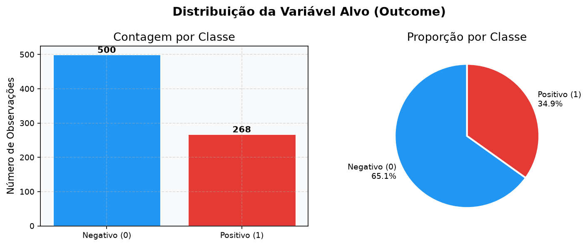
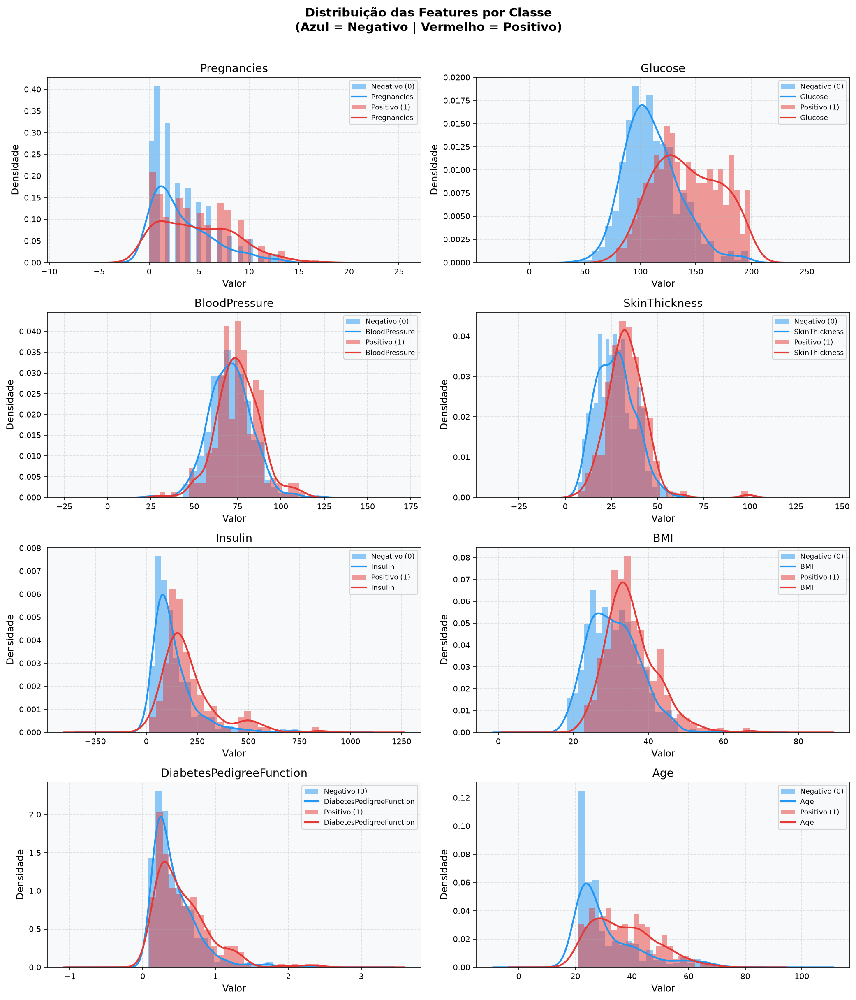
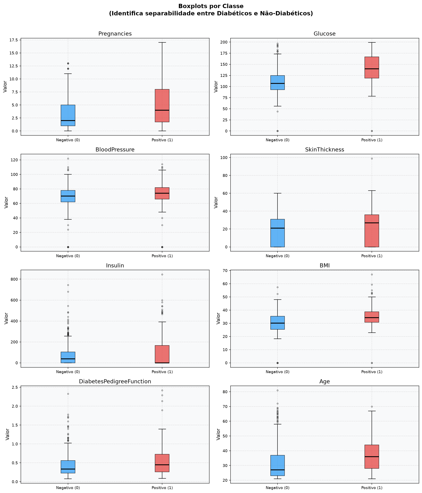
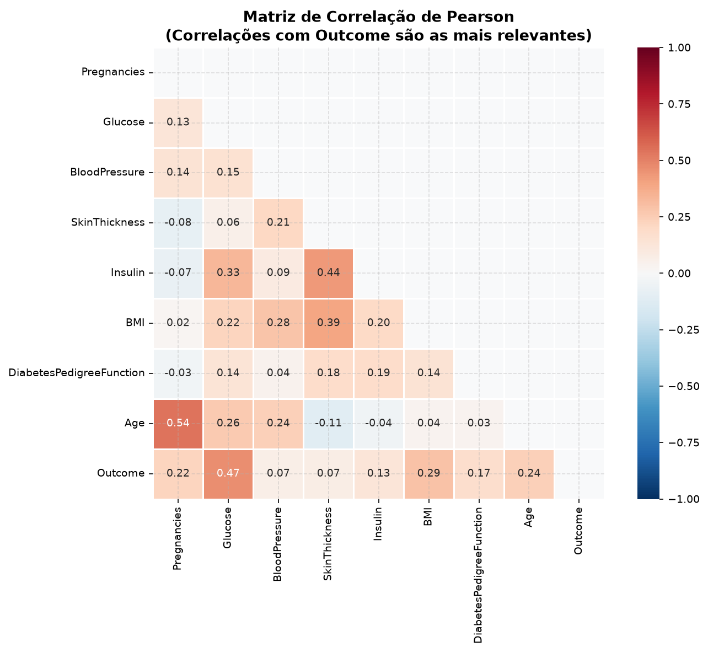
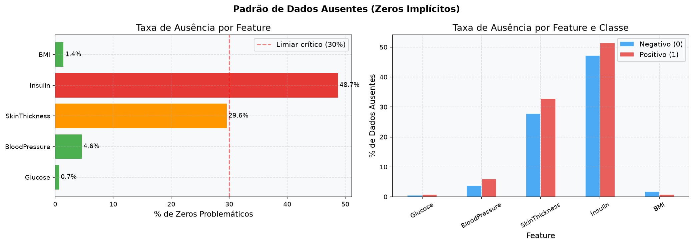
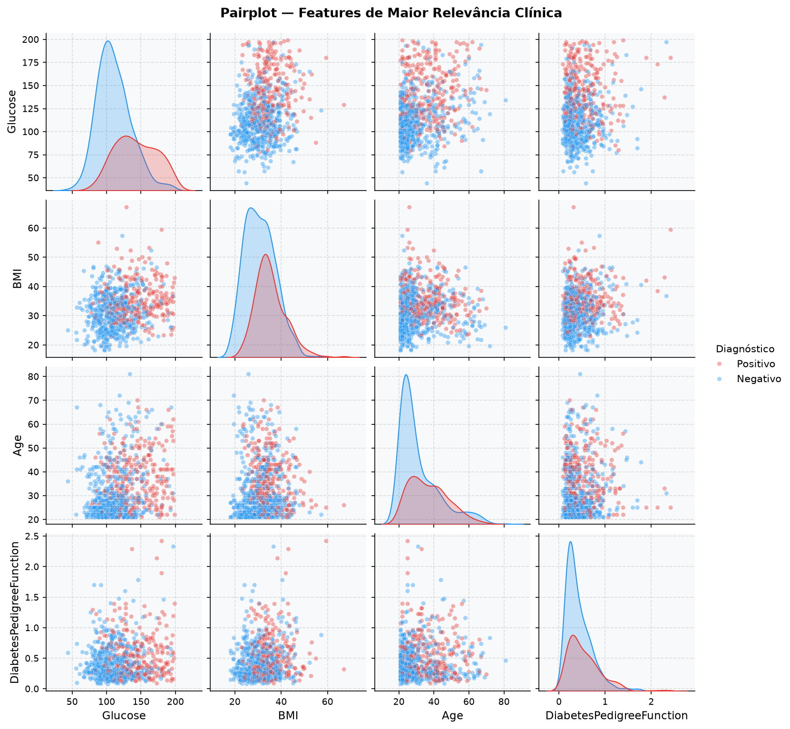
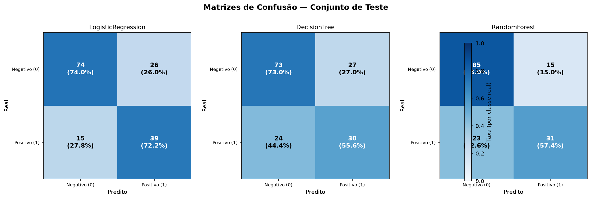
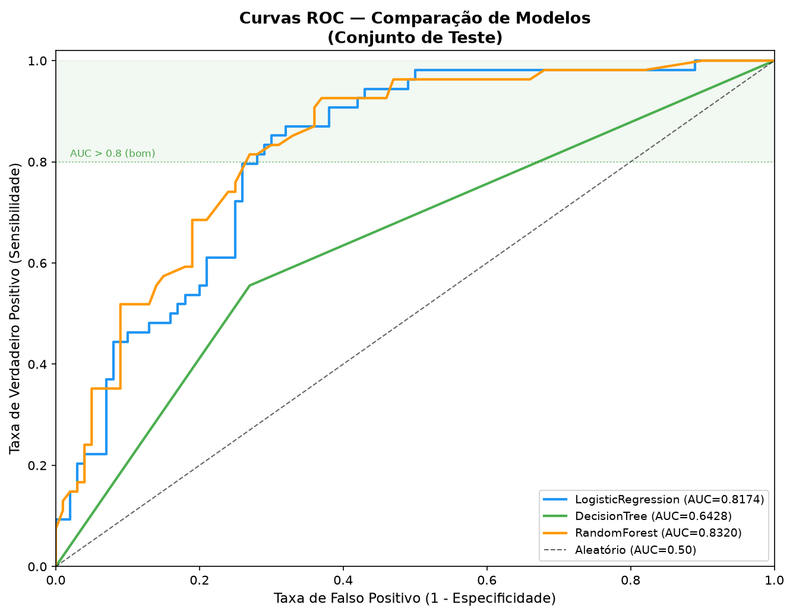
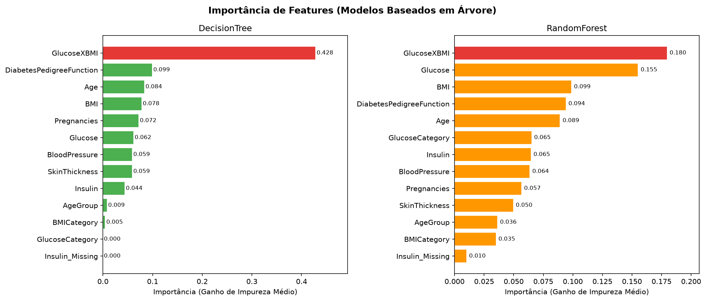
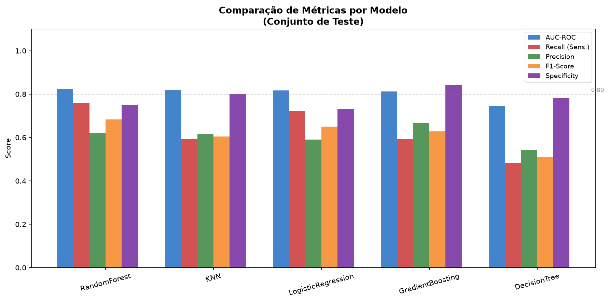

# Diabetes Risk Prediction using Machine Learning

> Predição de risco de Diabetes Mellitus Tipo 2 utilizando algoritmos supervisionados de Machine Learning aplicados a dados clínicos e laboratoriais.


---

## Sumário

- [Introdução](#introdução)
- [Importância do Estudo de Caso](#importância-do-estudo-de-caso)
- [Competências Demonstradas](#competências-demonstradas)
- [Tecnologias Utilizadas](#tecnologias-utilizadas)
- [Pipeline do Projeto](#pipeline-do-projeto)
- [Estrutura do Projeto](#estrutura-do-projeto)
- [Análise Exploratória](#análise-exploratória)
- [Resultados](#resultados)
- [Discussão Clínica](#discussão-clínica)
- [Conclusão](#conclusão)
- [Limitações e Críticas ao Projeto](#limitações-e-críticas-ao-projeto)
- [Trabalhos Futuros](#trabalhos-futuros)
- [Como Executar](#como-executar)
- [Notebook Técnico](#notebook-técnico)
- [Licença](#licença)

---

## Introdução

O **Diabetes Mellitus Tipo 2 (DM2)** é uma das doenças crônicas não transmissíveis de maior prevalência global. Segundo a *International Diabetes Federation (IDF)*, mais de **537 milhões de adultos** viviam com diabetes em 2021, número que pode ultrapassar **780 milhões até 2045** caso nenhuma intervenção estrutural seja adotada. No Brasil, o quadro também é crítico: o país ocupa a posição de **5º maior prevalência mundial**, com estimativas superiores a 16 milhões de casos diagnosticados.

A doença é marcada por um desenvolvimento silencioso. Grande parte dos pacientes permanece em estado de **pré-diabetes ou diabetes não diagnosticado** por anos, período durante o qual complicações metabólicas, cardiovasculares, renais, neurológicas e oftalmológicas, evoluem de forma progressiva e muitas vezes irreversível. Esse cenário torna o **diagnóstico precoce** não apenas desejável, mas clinicamente essencial.

Nesse contexto, técnicas de **Machine Learning aplicadas a dados clínicos** emergem como uma ferramenta complementar de apoio à triagem. Ao identificar padrões preditivos em variáveis como glicemia, IMC, idade e histórico familiar, modelos supervisionados podem sinalizar indivíduos em risco antes mesmo do surgimento de sintomas clínicos evidentes, ampliando a janela de oportunidade para intervenção preventiva.

Este projeto desenvolve, treina e compara três algoritmos de classificação supervisionada aplicados ao **Pima Indians Diabetes Database**, cobrindo um pipeline completo de Ciência de Dados: desde o pré-processamento e controle de *data leakage* até a avaliação por métricas clínicas e a interpretação dos resultados sob a perspectiva da Medicina Baseada em Evidências.

> Modelos preditivos não substituem o julgamento clínico, atuam como sistemas de apoio à decisão em triagem e atenção primária.

---

## Importância do Estudo de Caso

A escolha do DM2 como estudo de caso não é arbitrária. Ela combina **relevância epidemiológica**, **disponibilidade de dados públicos bem documentados** e **complexidade técnica adequada** para demonstrar competências em Ciência de Dados aplicada à Saúde.

### Por que DM2 é um problema ideal para Machine Learning?

O diagnóstico clínico de DM2 é relativamente bem definido, baseia-se em critérios laboratoriais objetivos como glicemia de jejum e HbA1c. Isso torna a variável alvo clara e mensurável, o que é um requisito fundamental para tarefas de classificação supervisionada.

Ao mesmo tempo, o risco de desenvolver a doença é influenciado por um conjunto heterogêneo de fatores: genéticos, metabólicos, comportamentais e demográficos. Essa multidimensionalidade é precisamente o tipo de problema onde modelos de ML oferecem vantagem em relação a regras clínicas simplificadas.

### Por que isso importa além do dado?

| Dimensão | Impacto |
|----------|---------|
| **Epidemiológica** | DM2 afeta centenas de milhões de pessoas, qualquer ganho em triagem tem impacto populacional significativo |
| **Econômica** | O custo global do diabetes ultrapassou **US$ 966 bilhões** em 2021 (IDF); diagnóstico precoce reduz gastos com complicações |
| **Assistencial** | Sistemas de saúde sobrecarregados se beneficiam de ferramentas que priorizam pacientes de maior risco |
| **Técnica** | O problema envolve desbalanceamento de classes, dados ausentes, variáveis correlacionadas e necessidade de interpretabilidade, desafios reais de projetos em produção |

### O que este projeto demonstra na prática?

Este projeto demonstra que é possível construir um pipeline reprodutível, modular e clinicamente fundamentado utilizando ferramentas open source amplamente adotadas na indústria. Mais do que produzir um modelo com boas métricas, o projeto evidencia a capacidade de:

- formular o problema de forma alinhada ao contexto de aplicação;
- tomar decisões técnicas justificadas (controle de *data leakage*, escolha de métricas clínicas);
- comunicar resultados de forma acessível para audiências técnicas e não técnicas.

---

## Competências Demonstradas

| Área | Habilidades |
|------|------------|
| **Dados** | EDA, pré-processamento, engenharia de atributos, controle de data leakage |
| **Modelagem** | Classificação supervisionada, comparação de algoritmos, avaliação clínica |
| **Engenharia** | Organização modular em Python, reprodutibilidade, documentação técnica |

---

## Tecnologias Utilizadas

| Categoria | Tecnologias |
|-----------|-------------|
| Linguagem | Python 3.11 |
| Manipulação de Dados | Pandas, NumPy |
| Machine Learning | Scikit-learn |
| Visualização | Matplotlib |
| Ambiente | Jupyter Notebook |
| Versionamento | Git / GitHub |

---

## Pipeline do Projeto

```
Dataset → EDA → Qualidade dos Dados → Pré-processamento → Divisão Treino/Teste → Treinamento dos Modelos → Avaliação → Comparação → Interpretação Clínica
```

Cada etapa é implementada como um módulo independente em `src/`, garantindo reprodutibilidade e separação de responsabilidades.

---

## Estrutura do Projeto

```text
diabetes-risk-prediction-ml/
│
├── data/
│   ├── raw/
│   └── processed/
├── models/
├── outputs/
│   ├── figures/
│   └── reports/
├── src/
│   ├── eda.py
│   ├── evaluate.py
│   ├── load_data.py
│   ├── preprocessing.py
│   └── train.py
├── notebooks/
│   └── diabetes_risk_prediction.ipynb
├── DATA_DICTIONARY.md
├── data_quality.py
├── LICENSE
├── PROJECT_PLAN.md
├── README.md
└── requirements.txt
```

---

## Análise Exploratória

### Distribuição das Classes

<p align="center">
  
</p>

**Figura 1.** Distribuição da variável alvo `Outcome`. O dataset apresenta desbalanceamento, aproximadamente 65% não diabéticos e 35% diabéticos. Esse desequilíbrio favorece artificialmente modelos que simplesmente predizem a classe majoritária, tornando métricas como Accuracy insuficientes como critério isolado de avaliação. Recall e F1-score são mais adequados para este contexto.

---

### Distribuição das Variáveis

<p align="center">
  
</p>

**Figura 2.** Distribuição de frequência de cada variável preditora. `Insulin` e `DiabetesPedigreeFunction` apresentam assimetria positiva acentuada, indicativo de cauda longa com possíveis valores extremos. `Glucose` e `BMI` exibem distribuições aproximadamente normais, compatíveis com o esperado clinicamente.

---

### Boxplots por Classe

<p align="center">
  
</p>

**Figura 3.** Distribuições estratificadas pela variável alvo. `Glucose` e `BMI` apresentam separação clara entre pacientes diabéticos e não diabéticos, confirmando seu poder discriminativo. `BloodPressure` exibe menor diferença entre os grupos, indicativo de menor contribuição isolada ao modelo.

---

### Mapa de Correlação

<p align="center">
  
</p>

**Figura 4.** Correlações de Pearson entre as variáveis. `Glucose` apresenta a maior correlação linear com `Outcome` (~0.47). `Age` e `BMI` seguem como variáveis moderadamente correlacionadas ao desfecho. Não há multicolinearidade severa entre os preditores, o que favorece a estabilidade de modelos lineares como a Regressão Logística.

---

### Dados Ausentes

<p align="center">
  
</p>

**Figura 5.** Padrão de dados ausentes por variável, representados como zeros biologicamente impossíveis em variáveis como `Glucose`, `BloodPressure`, `BMI`, `Insulin` e `SkinThickness`. `Insulin` e `SkinThickness` concentram as maiores taxas de ausência, exigindo estratégia de imputação cuidadosa para evitar viés. A imputação foi ajustada exclusivamente no conjunto de treino, preservando o isolamento do conjunto de teste.

---

### Pairplot das Variáveis-Chave

<p align="center">
  
</p>

**Figura 6.** Relações bivariadas entre as principais variáveis, coloridas por `Outcome`. A combinação `Glucose × BMI` exibe a melhor separabilidade visual entre as classes. Nenhuma combinação bivariada isola perfeitamente os grupos, justificando o uso de modelos multivariados e confirmando a complexidade do problema.

---

## Resultados

### Matrizes de Confusão

<p align="center">
  
</p>

**Figura 7.** Comparação das matrizes de confusão dos três modelos. A análise dos **Falsos Negativos** (diabéticos classificados como saudáveis) é prioritária neste contexto, representam o erro clínico de maior consequência, pois atrasam o diagnóstico e o início do tratamento. Um modelo que minimiza FN a custo de mais FP ainda pode ser clinicamente preferível em triagem.

---

### Curvas ROC

<p align="center">
  
</p>

**Figura 8.** Curvas ROC dos modelos avaliados. A Área Sob a Curva (AUC) mede a capacidade discriminativa geral do modelo em diferentes limiares de decisão, independentemente do ponto de corte adotado. Valores de AUC próximos de 1,0 indicam alta separabilidade entre classes. Em aplicações clínicas, o limiar de decisão pode ser ajustado para priorizar Sensibilidade em detrimento de Especificidade conforme o contexto de triagem.

---

### Importância das Variáveis

<p align="center">
  
</p>

**Figura 9.** Importância relativa das variáveis segundo o Random Forest. `Glucose`, `BMI`, `Age` e `DiabetesPedigreeFunction` lideram o ranking, resultado compatível com a literatura médica e que corrobora a hipótese H1 formulada antes da modelagem. A consistência entre a importância estatística do modelo e o conhecimento clínico preestabelecido é um sinal positivo de validade de construto.

---

### Comparação de Desempenho

<p align="center">
  
</p>

**Figura 10.** Comparação consolidada das métricas entre os três modelos avaliados no conjunto de teste.

| Modelo | Vantagens | Limitações |
|--------|-----------|------------|
| **Logistic Regression** | Alta interpretabilidade; coeficientes diretamente interpretáveis; baseline clínico consolidado | Assume relações lineares entre preditores e log-odds |
| **Decision Tree** | Interpretação intuitiva via regras de decisão; captura não linearidades | Elevada variância; tendência ao overfitting sem restrição de profundidade |
| **Random Forest** | Alta capacidade preditiva; robusto a ruído e outliers; reduz variância via ensemble | Menor interpretabilidade direta; maior custo computacional |

> Em triagem clínica, **Recall (Sensibilidade)** é a métrica prioritária. Um modelo com Recall de 0.80 e Precision de 0.65 pode ser preferível a um com Recall de 0.65 e Precision de 0.80, desde que o custo assistencial do falso negativo supere o do falso positivo, o que é o caso no rastreamento de DM2.

---

## Discussão Clínica

### Os resultados fazem sentido clinicamente?

A liderança de `Glucose` no ranking de importância é o resultado mais esperado e clinicamente fundamentado. A glicemia é o principal critério diagnóstico do DM2 segundo a Organização Mundial da Saúde (OMS) e a American Diabetes Association (ADA) sua presença como preditor mais relevante valida que o modelo aprendeu um padrão biologicamente coerente, e não um artefato estatístico.

`BMI` como segundo preditor é igualmente consistente com a literatura: a obesidade, especialmente a adiposidade visceral, está mecanisticamente associada à resistência à insulina, o substrato fisiopatológico central do DM2. `Age` reflete o envelhecimento progressivo da função pancreática e o acúmulo de exposição aos fatores de risco ao longo da vida. `DiabetesPedigreeFunction` captura predisposição genética e histórico familiar, fatores de risco não modificáveis bem estabelecidos.

Esse alinhamento entre os preditores estatísticos do modelo e os fatores de risco clinicamente reconhecidos é denominado **validade de construto** um requisito essencial para que um modelo preditivo seja considerado confiável em aplicações de saúde.

### Pode ser usado em triagem?

Em tese, sim, com ressalvas importantes. Um modelo com AUC adequada pode ser integrado a fluxos de triagem em atenção primária para **estratificar risco** e **priorizar investigação complementar** (solicitação de glicemia de jejum, HbA1c, TOTG). Isso é especialmente relevante em contextos de recursos limitados, onde não é viável realizar exames laboratoriais em toda a população adscrita.

O modelo funcionaria como um **sinalizador de risco**, não como instrumento diagnóstico. Pacientes sinalizados como de alto risco seriam encaminhados para avaliação clínica e laboratorial, reduzindo o custo de triagem sem substituir o processo diagnóstico.

### O que o modelo não consegue fazer?

O modelo não tem acesso a informações fundamentais para o diagnóstico clínico real:

- **Histórico clínico completo**, uso de medicamentos, comorbidades, hábitos de vida
- **Exame físico**, distribuição de gordura corporal, acanthosis nigricans, sinais de resistência insulínica
- **Exames complementares adicionais**, HbA1c, curva glicêmica, perfil lipídico
- **Contexto socioeconômico e comportamental**, sedentarismo, dieta, tabagismo

Nenhuma dessas dimensões está presente no dataset. O modelo captura apenas o padrão estatístico aprendido de 768 observações de uma população específica, generalização para outros contextos exige validação externa rigorosa.

### Implicações éticas

A implantação de modelos preditivos em saúde levanta questões éticas que este projeto reconhece explicitamente:

- **Viés de representação:** o dataset é restrito a mulheres adultas de origem Pima. Um modelo treinado nessa população pode apresentar desempenho degradado em homens, idosos, outras etnias ou populações com diferentes prevalências de fatores de risco.
- **Transparência algorítmica:** em contextos clínicos, é preferível utilizar modelos interpretáveis (como Regressão Logística) que permitem ao profissional compreender *por que* o sistema indicou determinado risco, não apenas *qual* foi o resultado.
- **Responsabilidade da decisão:** a decisão clínica permanece integralmente sob responsabilidade do profissional de saúde. O modelo é uma ferramenta de apoio, não de substituição.

---

## Conclusão

Este projeto demonstrou que é possível construir um pipeline completo e clinicamente fundamentado de predição de risco de Diabetes Mellitus Tipo 2 utilizando algoritmos supervisionados de Machine Learning, com foco em reprodutibilidade, controle rigoroso de *data leakage* e avaliação alinhada ao contexto de aplicação.

Os três modelos avaliados, Regressão Logística, Árvore de Decisão e Random Forest, apresentaram desempenhos distintos que refletem suas características estruturais. O Random Forest demonstrou maior capacidade preditiva geral, enquanto a Regressão Logística manteve vantagem em interpretabilidade, um atributo crítico em aplicações clínicas.

A análise de importância das variáveis revelou um padrão **consistente com a literatura médica**: `Glucose`, `BMI`, `Age` e `DiabetesPedigreeFunction` emergiram como os principais preditores, corroborando a hipótese H1 e conferindo validade de construto ao modelo.

Do ponto de vista técnico, o projeto evidencia competências em:

- formulação de problemas de classificação com restrições clínicas;
- controle de vazamento de dados em pipelines supervisionados;
- seleção de métricas adequadas ao custo assimétrico dos erros;
- interpretação de resultados além das métricas, ancorando a análise em evidências clínicas.

Embora desenvolvido com finalidade educacional, a estrutura e as decisões técnicas do projeto refletem práticas adotadas em ambientes profissionais de Ciência de Dados aplicada à Saúde, incluindo o desenvolvimento de **Clinical Decision Support Systems (CDSS)**, ferramentas de triagem populacional e projetos de pesquisa clínica com dados de prontuário eletrônico.

---

## Limitações e Críticas ao Projeto

Esta seção apresenta uma avaliação honesta das limitações técnicas e metodológicas do projeto, incluindo pontos que comprometem a qualidade e que devem ser endereçados em versões futuras.

### Limitações do Dataset

| Limitação | Impacto |
|-----------|---------|
| Apenas mulheres adultas de origem Pima | Generalização restrita, o modelo não pode ser aplicado indiscriminadamente a outras populações |
| 768 observações | Amostra pequena para treinar modelos robustos e estimar intervalos de confiança confiáveis |
| Zeros biologicamente impossíveis | `Glucose = 0`, `BMI = 0` e `Insulin = 0` são clinicamente inviáveis, a qualidade dos dados de origem é questionável |
| Ausência de variáveis comportamentais | Sedentarismo, dieta, tabagismo e uso de medicamentos são fatores de risco relevantes que não estão no dataset |

### Limitações Metodológicas

**Ausência de validação cruzada:** a avaliação em uma única divisão treino/teste é estatisticamente frágil. Os resultados dependem do `random_state` escolhido e podem variar significativamente em outras divisões. Validação cruzada estratificada (k-fold) produziria estimativas mais confiáveis e intervalos de variação das métricas.

**Sem calibração probabilística:** os modelos foram avaliados por suas predições de classe, mas não pela qualidade de suas probabilidades estimadas. Em aplicações clínicas, a probabilidade predita deve refletir a frequência real do desfecho, isso requer calibração (Platt Scaling ou Isotonic Regression) e avaliação com Brier Score e curva de calibração.

**Sem otimização de hiperparâmetros:** os modelos foram treinados com parâmetros padrão. Um processo de busca sistemática (GridSearchCV ou RandomizedSearchCV com cross-validation) poderia melhorar o desempenho e garantir que as comparações entre modelos sejam mais justas.

**Limiar de decisão fixo em 0.5:** o limiar padrão raramente é o ideal em problemas com desbalanceamento de classes ou custo assimétrico de erros. Em triagem de DM2, um limiar mais baixo (ex: 0.35–0.40) aumentaria o Recall à custa de mais Falsos Positivos, tradeoff que deve ser analisado explicitamente.

**Interpretabilidade limitada do Random Forest:** o modelo de melhor desempenho é também o menos interpretável. A ausência de técnicas como SHAP Values impede entender *como* cada variável influencia a predição individual, requisito crescente em aplicações reguladas de IA em saúde.

**Sem análise de erro:** não foi realizada análise qualitativa dos casos classificados incorretamente. Entender o perfil dos Falsos Negativos (quais pacientes o modelo falha em detectar) é tão importante quanto as métricas agregadas.

---

## Trabalhos Futuros

- Validação cruzada estratificada (k = 5 ou k = 10) com reporte de média ± desvio padrão das métricas
- Otimização de hiperparâmetros via GridSearchCV e RandomizedSearchCV
- Calibração probabilística e avaliação com Brier Score e curva de calibração
- Ajuste explícito do limiar de decisão com análise do tradeoff Precision-Recall
- Explicabilidade individual com **SHAP Values** e LIME
- Avaliação de algoritmos de gradient boosting: XGBoost, LightGBM e CatBoost
- Análise de erro qualitativa — perfil dos Falsos Negativos
- Validação externa em dataset de população diferente
- API de inferência com FastAPI ou Flask
- Interface de triagem interativa com Streamlit
- Containerização com Docker para portabilidade

---

## Como Executar

```bash
git clone https://github.com/SEU-USUARIO/diabetes-risk-prediction-ml.git
cd diabetes-risk-prediction-ml
python -m venv .venv
source .venv/bin/activate        # Linux/macOS
# .venv\Scripts\Activate.ps1    # Windows
pip install -r requirements.txt
```

---

## Notebook Técnico

A análise completa: código, parâmetros, tabelas e discussão técnica detalhada, está disponível em:

[`notebooks/diabetes_risk_prediction.ipynb`](notebooks/modeling_prediction.ipynb)

---

## Licença

Distribuído sob a licença **MIT**. Consulte o arquivo `LICENSE` para mais informações.

## Referências

**Epidemiologia e Diretrizes Clínicas**

- International Diabetes Federation (IDF). *IDF Diabetes Atlas, 10th edition*. Brussels: IDF, 2021. Disponível em: https://diabetesatlas.org
- World Health Organization (WHO). *Global Report on Diabetes*. Geneva: WHO, 2016. Disponível em: https://www.who.int/publications/i/item/9789241565257
- American Diabetes Association (ADA). *Standards of Medical Care in Diabetes — 2024*. *Diabetes Care*, v. 47, Supplement 1, 2024. Disponível em: https://diabetesjournals.org/care
- Sociedade Brasileira de Diabetes (SBD). *Diretrizes da Sociedade Brasileira de Diabetes 2023*. Disponível em: https://diretrizesdiabetes.org.br
- Ministério da Saúde (Brasil). *Vigitel Brasil 2022 — Vigilância de Fatores de Risco e Proteção para Doenças Crônicas por Inquérito Telefônico*. Brasília: MS, 2023.

---

**Dataset**

- Smith, J. W. et al. *Using the ADAP Learning Algorithm to Forecast the Onset of Diabetes Mellitus*. In: Proceedings of the Annual Symposium on Computer Application in Medical Care, 1988. p. 261–265.
- UCI Machine Learning Repository. *Pima Indians Diabetes Database*. Disponível em: https://archive.ics.uci.edu/ml/datasets/diabetes
- Kaggle. *Pima Indians Diabetes Database*. Disponível em: https://www.kaggle.com/datasets/uciml/pima-indians-diabetes-database

---

**Machine Learning e Ciência de Dados**

- Pedregosa, F. et al. *Scikit-learn: Machine Learning in Python*. *Journal of Machine Learning Research*, v. 12, p. 2825–2830, 2011. Disponível em: https://jmlr.org/papers/v12/pedregosa11a.html
- Hastie, T.; Tibshirani, R.; Friedman, J. *The Elements of Statistical Learning: Data Mining, Inference, and Prediction*. 2. ed. New York: Springer, 2009.
- Géron, A. *Hands-On Machine Learning with Scikit-Learn, Keras, and TensorFlow*. 3. ed. Sebastopol: O'Reilly Media, 2022.
- Breiman, L. *Random Forests*. *Machine Learning*, v. 45, n. 1, p. 5–32, 2001.

---

**ML Aplicado à Saúde e Interpretabilidade**

- Obermeyer, Z.; Emanuel, E. J. *Predicting the Future — Big Data, Machine Learning, and Clinical Medicine*. *New England Journal of Medicine*, v. 375, p. 1216–1219, 2016.
- Lundberg, S. M.; Lee, S.-I. *A Unified Approach to Interpreting Model Predictions*. In: Advances in Neural Information Processing Systems (NeurIPS), 2017. *(Base teórica do SHAP Values)*
- Ribeiro, M. T.; Singh, S.; Guestrin, C. *"Why Should I Trust You?": Explaining the Predictions of Any Classifier*. In: Proceedings of the 22nd ACM SIGKDD, 2016. *(Base teórica do LIME)*
- Steyerberg, E. W. *Clinical Prediction Models: A Practical Approach to Development, Validation, and Updating*. 2. ed. New York: Springer, 2019.
- Collins, G. S. et al. *Transparent Reporting of a Multivariable Prediction Model for Individual Prognosis or Diagnosis (TRIPOD): The TRIPOD Statement*. *BMJ*, v. 350, 2015. *(Guia de boas práticas para modelos preditivos clínicos)*

---

**Ferramentas e Documentação Técnica**

- McKinney, W. *Data Structures for Statistical Computing in Python*. In: Proceedings of the 9th Python in Science Conference, 2010. *(Pandas)* — https://pandas.pydata.org/docs
- Harris, C. R. et al. *Array Programming with NumPy*. *Nature*, v. 585, p. 357–362, 2020. — https://numpy.org/doc
- Hunter, J. D. *Matplotlib: A 2D Graphics Environment*. *Computing in Science & Engineering*, v. 9, n. 3, p. 90–95, 2007. — https://matplotlib.org/stable/index.html

---

> As referências de epidemiologia e diretrizes clínicas são as mais relevantes para contextualizar o problema no README. As de ML aplicado à saúde — especialmente TRIPOD, Obermeyer e os papers de SHAP/LIME — são úteis para embasar a discussão clínica e os trabalhos futuros caso o projeto evolua para um contexto acadêmico ou profissional.